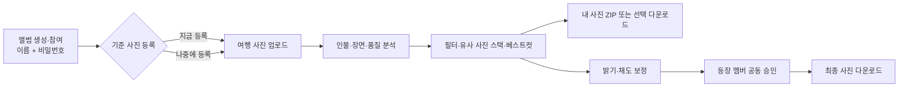
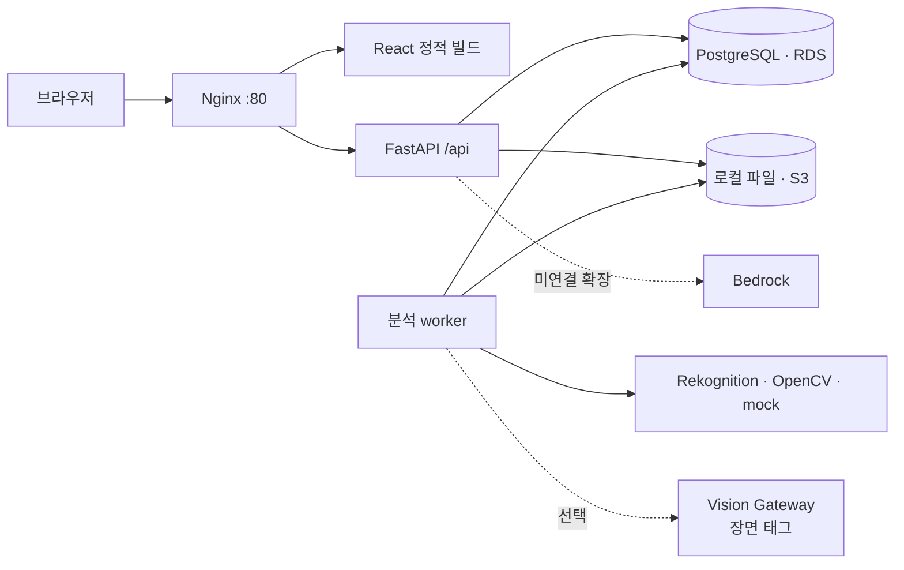

<div align="center">
  
  <h1>찍 · ZZIK</h1>
  <p><strong>여행 사진을 함께 모으고, 인물과 장면별로 정리하는 공유 앨범</strong></p>
  <p>각자의 사진을 한곳에 모아 내 사진과 베스트컷을 찾고, 보정본을 함께 승인해 간직합니다.</p>
  <p>
    
    
    
    
    
  </p>
</div>

<p align="center">
  
</p>

2026년 국민대학교 캠퍼스타운 키로톤 01팀 **토큰사냥꾼** 프로젝트입니다.

> **문서 기준:** `main`의 `51e499c`까지 반영된 기능. EC2·Nginx·systemd·RDS·S3 배포 자산은 준비되어 있지만, 현재 공개 URL과 실제 AWS 권한 및 전체 E2E 성공 여부는 배포 환경에서 별도로 확인해야 합니다.
> **배포 주소:** [http://3.236.248.250](http://3.236.248.250)  

[서비스 흐름](#서비스-흐름) · [주요 기능](#주요-기능) · [ai이미지-분석](#ai이미지-분석) · [빠른 시작](#빠른-시작) · [전체 로컬 실행](#전체-로컬-실행) · [주요 설정](#주요-설정) · [테스트](#테스트) · [현재 제한사항](#현재-제한사항)

## 서비스 소개

여행이 끝나면 사진은 여러 사람의 휴대폰에 흩어지고, 원하는 사진을 다시 고르는 데 많은 시간이 듭니다. 찍은 초대 코드로 앨범에 사진을 모으고, 인물·단체 여부·장면 태그·사진 품질에 따라 자동으로 정리합니다.

멤버는 이름과 앨범 비밀번호로 다시 입장해 기존 기준 사진과 업로드 기록을 이어갈 수 있습니다. 분석 후에는 내가 등장한 사진, 다른 사람이 찍어준 사진, 단체 사진과 베스트컷을 찾고 한 번에 내려받을 수 있습니다. 밝기·채도 보정본은 사진에 나온 멤버들이 모두 승인하면 최종본으로 확정됩니다.

## 서비스 흐름



기준 사진은 참여 직후 건너뛰고 갤러리에서 나중에 등록할 수 있습니다. 뒤늦게 등록한 뒤에는 미등록 얼굴이 남은 사진만 다시 분류할 수 있습니다.

## 화면 미리보기

### 인물·장면별 앨범 갤러리

<p align="center">
  
</p>

등장 인물, 얼굴 상태, 장면 태그, 업로더, 단체샷, 베스트컷으로 사진을 좁혀 봅니다. 촬영 시각이 가까운 연사와 시각적으로 유사한 사진은 대표 BEST 컷의 스택으로 표시됩니다.

### 사진 분석과 보정

<p align="center">
  
</p>

사진별 등장 인물과 일치도, 선명도·밝기·눈 뜬 비율을 확인하고 인물을 수동으로 수정하거나 사진 한 장을 다시 분석할 수 있습니다.

### 멤버별 사진 누락 현황

<p align="center">
  
</p>

앨범 전체 사진을 기준으로 각 멤버가 등장한 사진 수와 비율을 집계합니다.

> 화면 이미지는 `?data=mock` 브라우저 데모에서 촬영했습니다. 데모 사진은 [Unsplash](https://unsplash.com/) 이미지를 사용하며, `샘플 분석` 값은 실제 얼굴 인식 결과가 아닙니다.

## 주요 기능

| 기능 | 구현 내용 |
|---|---|
| 공유 앨범 | 초대 코드·표시 이름·4자 이상 비밀번호로 생성 및 참여, 서명 세션 쿠키로 앨범 접근 제어 |
| 멤버 재입장 | 같은 앨범에서 기존 이름과 비밀번호가 일치하면 동일한 멤버 ID, 기준 사진, 업로드 기록을 복원 |
| 앨범 전환 | 헤더의 `나가기`로 현재 브라우저의 앨범 상태를 지우고 다른 초대 코드로 입장 |
| 기준 얼굴 | 정면 사진에서 얼굴이 정확히 한 명인지 검증하며, 참여 직후 건너뛰고 나중에 등록 가능 |
| 사진 업로드 | JPEG·PNG·HEIC/HEIF 다중 업로드와 파일별 성공·실패 반환. HEIC/HEIF는 서버에서 JPEG로 변환 |
| 사진 분석 | 기준 얼굴 매칭, 얼굴 상태, 장면 태그, 품질 지표, 베스트 점수와 분석 진행 상태 저장 |
| 갤러리 | 내 사진·단체샷·인물 조합·얼굴 상태·장면 태그·업로더 필터와 촬영 시각·추천 점수 정렬 |
| 유사 사진 스택 | 촬영 간격과 perceptual hash를 이용해 연사·근사 중복 사진을 묶고 대표 컷 표시 |
| 재분석 | 실패 사진, 미등록 얼굴 사진, 앨범 전체 또는 사진 한 장을 사용자 요청으로 다시 분석 |
| 다운로드 | 원본·보정본 개별 다운로드, 선택 사진 ZIP, 현재 멤버가 등장한 전체 사진 ZIP |
| 보정 버전 | 원본 기반 밝기·채도 조절, 원본 비교, 이전 버전에서 새 버전 생성 |
| 공동 승인 | 등장 확정 멤버의 명시적 승인·취소와 조건을 충족한 최종본 집계 |
| 누락 현황 | 앨범 전체 사진 수와 멤버별 등장 사진 수 확인 |

`내 사진 받기`는 내가 **업로드한 사진**이 아니라 현재 세션 멤버가 등장 인물로 확정되고 제외 처리되지 않은 사진을 `zzik-my-photos.zip`으로 내려받습니다. `올린이` 필터는 등장 인물 필터와 별개이며, 내가 올린 사진과 다른 사람이 올린 사진을 구분합니다.

분석 worker는 API와 별도 프로세스로 실행됩니다. 중단된 분석은 5분 lease 이후 회수하며 최대 3회 작업 시도 후 실패 처리합니다.

## 멤버 비밀번호와 세션

- 비밀번호는 앨범 안에서 같은 표시 이름의 사용자를 확인하기 위한 값이며 별도의 이메일·계정 시스템은 없습니다.
- 길이는 4~64자이며 `PBKDF2-HMAC-SHA256`과 무작위 salt로 해시해 저장합니다.
- 기존 이름으로 참여할 때 비밀번호가 일치하면 같은 멤버로 재입장합니다. 틀리면 다른 이름을 사용해야 합니다.
- 비밀번호 기능 추가 이전 멤버는 같은 이름으로 처음 재입장한 사람이 새 비밀번호를 설정합니다.
- 헤더의 `나가기`는 브라우저 `sessionStorage`의 현재 앨범 상태를 지우는 동작입니다. 별도의 서버 logout endpoint는 없으며, 다른 앨범에 참여하면 세션 쿠키가 새 멤버로 교체됩니다.

## 보정과 승인 규칙

- 밝기는 `0.5~1.5`, 채도는 `0.0~2.0` 범위입니다. 모든 설정은 원본에 적용하며 보정본을 반복 덮어쓰지 않습니다.
- 새 버전은 승인 0개로 시작하고, 좋아요나 저장 행위를 승인으로 간주하지 않습니다.
- 분석 완료 후 현재 앨범의 확정된 등장 멤버가 승인합니다. `no_face`이거나 확정 멤버가 없으면 업로더 1명의 승인이 필요합니다.
- 미확정·미등록 얼굴은 임의로 승인 대상에 넣지 않습니다.
- 승인 조건을 충족한 버전 중 번호가 가장 큰 버전이 최종본입니다. 승인 취소 시 이전 충족 버전으로 돌아갈 수 있습니다.
- 인물 변경이나 재분석이 일어나면 기존 승인을 무효화합니다. 재분석 중에도 수동 인물 지정과 제외 표시는 보존됩니다.
- CSS 기반 빠른 미리보기는 근사값입니다. 저장 후에는 서버가 생성한 JPEG를 표시하고 같은 객체를 다운로드합니다.

## AI·이미지 분석

| 영역 | 현재 상태 |
|---|---|
| Amazon Rekognition | 얼굴 탐지, 기준 얼굴 비교, 장면 라벨, 얼굴 품질 지표를 제공하는 실제 분석 경로 |
| OpenCV local | YuNet/SFace로 얼굴 탐지·비교, 색상·질감 휴리스틱으로 장면 라벨, Haar 기반 눈 뜸 근사를 수행하는 오프라인 경로 |
| 결정론적 mock | AWS 없이 동일한 API·DB·worker 흐름을 시연하는 합성 결과 경로 |
| 외부 Vision Gateway | OpenAI 호환 멀티모달 endpoint로 사진을 전송해 **장면 태그만** 교체하는 선택적 하이브리드 경로 |
| 유사 사진 묶기 | 64-bit dHash와 촬영 시각을 이용해 근사 중복·연사 그룹의 `burst_group_id` 계산 |
| 베스트컷 | 그룹 안에서 선명도·밝기·눈 뜬 비율의 상대 점수로 대표 컷 선택 |
| Bedrock 여행 요약 | 집계 사실 기반 3줄 요약과 자연어 필터 구조화 모듈 구현, 메인 API/UI에는 미연결 |
| 미등록 얼굴 그룹 | 얼굴 crop 유사도 그룹화 모듈 구현, 메인 API/UI에는 미연결 |

`FACE_PROVIDER`는 `mock`, `local`, `rekognition` 중 하나를 사용합니다. 분석은 자동으로 다른 provider로 폴백하지 않습니다. `local`의 기본 유사도 임계값은 70, 나머지는 90이며 `SIMILARITY_THRESHOLD`로 명시할 수 있습니다.

`VISION_PROVIDER=gateway`는 얼굴 provider의 얼굴 수·인물 연결·품질 점수를 유지하고 태그만 외부 AI 결과로 교체합니다. 활성화하면 이미지 전체가 base64 data URL로 외부 endpoint에 전송되며, 인증·TLS·응답 오류는 분석 실패로 처리됩니다.

세부 입출력과 판정 규칙은 [사진 분석 계약](docs/contracts/role-4-analysis.md)을 참고하세요.

## 기술 구성

| 영역 | 기술 |
|---|---|
| 프론트엔드 | React 19.3, TypeScript 7, Vite 8, Vitest, Testing Library |
| API | Python 3.13, FastAPI, HttpOnly 서명 세션 쿠키 |
| 데이터베이스 | SQLAlchemy 2, Alembic, PostgreSQL / 로컬 SQLite |
| 이미지 처리 | Pillow, pillow-heif, OpenCV, 원본·썸네일·보정본 분리 저장 |
| 얼굴 분석 | Amazon Rekognition / OpenCV YuNet·SFace / 결정론적 mock |
| 장면 분류 | Rekognition labels / local 휴리스틱 / OpenAI 호환 Vision Gateway |
| 생성형 AI 확장 | Amazon Bedrock, Anthropic SDK |
| 저장소 | 로컬 파일 / 비공개 Amazon S3 |
| 배포 | Nginx + FastAPI + worker를 단일 EC2에서 실행, 외부 RDS·S3 연결 |

의존성 버전은 [requirements.txt](requirements.txt)와 [frontend/package-lock.json](frontend/package-lock.json)을 기준으로 설치합니다. DB 스키마는 Alembic `0001`~`0005`이며 항상 `upgrade head`로 적용합니다.



## 실행 모드

프론트 브라우저 샘플 모드와 백엔드 분석 provider는 서로 다른 설정입니다.

| 실행 방식 | 의미 |
|---|---|
| 일반 프론트 URL | 실제 FastAPI의 같은 origin `/api`를 사용하는 기본 모드 |
| `?data=mock` | 백엔드 없이 UI만 둘러보는 브라우저 샘플 모드. 실제 저장·다운로드 없음 |
| `FACE_PROVIDER=mock` | 실제 API·DB·파일 저장 흐름에서 합성 분석 결과 사용 |
| `FACE_PROVIDER=local` | OpenCV 사전학습 모델을 이용해 AWS 없이 실제 얼굴 탐지·비교 수행 |
| `FACE_PROVIDER=rekognition` | worker가 실제 AWS Rekognition 호출. AWS 표준 자격증명과 IAM 권한 필요 |
| `VISION_PROVIDER=off` | 얼굴 provider가 만든 장면 태그를 그대로 사용하는 기본값 |
| `VISION_PROVIDER=gateway` | 외부 멀티모달 gateway가 장면 태그를 교체하고 화면에 `AI 분류` 표시 |

## 빠른 시작

Node.js 24와 npm이 필요합니다. 백엔드 없이 UI만 확인하려면 다음 명령을 실행합니다.

```bash
git clone https://github.com/nxtcloud-edu/2026-kmuct-kt-team01.git
cd 2026-kmuct-kt-team01/frontend
npm ci
npm run dev
```

터미널에 표시된 Vite 주소 뒤에 `?data=mock`을 붙여 접속합니다.

```text
http://127.0.0.1:5173/?data=mock
```

샘플 모드는 브라우저 메모리의 데모 데이터를 사용합니다. 업로드·분석·보정 저장·ZIP 다운로드 결과를 실제 영속 데이터나 얼굴 인식 정확도로 해석하지 않습니다.

## 전체 로컬 실행

### 1. 백엔드 환경 준비

저장소 루트에서 Python 3.13 가상환경을 만들고 고정된 의존성을 설치합니다.

```bash
python3.13 -m venv .venv
source .venv/bin/activate
python -m pip install -r requirements.txt
```

Windows PowerShell에서는 `.\.venv\Scripts\Activate.ps1`로 활성화합니다.

### 2. 로컬 설정

다음 값은 AWS 없이 SQLite·로컬 파일·OpenCV 분석으로 실제 API 흐름을 확인하는 macOS/Linux 예시입니다. API와 worker를 실행하는 두 터미널에 동일하게 적용합니다.

```bash
export DATABASE_URL='sqlite+pysqlite:///./zzik_local.db'
export STORAGE_BACKEND='local'
export LOCAL_STORAGE_PATH='./storage'
export FACE_PROVIDER='local'
export VISION_PROVIDER='off'
export AWS_REGION='us-east-1'
export SESSION_SECRET='replace-with-your-own-local-secret'
```

빠른 합성 분석이 필요하면 `FACE_PROVIDER=mock`으로 바꿉니다. PowerShell에서는 `export NAME=value` 대신 `$env:NAME = 'value'`를 사용합니다. API 설정 일부는 `.env`도 읽지만 분석 provider와 Vision Gateway까지 일관되게 적용하려면 프로세스 환경변수로 전달하는 편이 안전합니다.

### 3. 마이그레이션과 API

```bash
python -m alembic upgrade head
python -m uvicorn backend.app.main:app --host 127.0.0.1 --port 8000
```

- API 문서: `http://127.0.0.1:8000/docs`
- DB 준비 상태: `http://127.0.0.1:8000/api/health/ready`

### 4. 분석 worker

별도 터미널에서 같은 가상환경과 환경변수를 적용합니다.

```bash
python -m backend.app.worker
```

worker가 없으면 업로드 사진은 `pending` 상태에 머뭅니다. readiness endpoint는 DB 연결만 검사하며 저장소·분석 provider·전체 사용자 흐름의 성공을 보장하지 않습니다.

### 5. 프론트엔드

세 번째 터미널에서 실행합니다.

```bash
cd frontend
npm ci
npm run dev
```

브라우저에서 Vite가 표시한 기본 주소로 접속합니다.

```text
http://127.0.0.1:5173/
```

기본 URL은 실제 API 모드이며 Vite가 `/api`를 `http://127.0.0.1:8000`으로 프록시합니다. 다른 API 주소를 사용하려면 `frontend/.env.local`에 `VITE_API_TARGET`을 설정하고 Vite를 다시 시작합니다.

```dotenv
VITE_API_TARGET=http://127.0.0.1:8000
```

## 주요 설정

| 변수 | 기본값 / 용도 |
|---|---|
| `DATABASE_URL` | API·worker·Alembic이 함께 사용하는 SQLAlchemy 연결 문자열 |
| `SESSION_SECRET` | 세션 쿠키 서명 키. 운영에서는 길고 무작위인 값 사용 |
| `STORAGE_BACKEND` | `local` 또는 `s3` |
| `LOCAL_STORAGE_PATH` | 로컬 저장소 경로. API와 worker가 동일 위치 사용 |
| `S3_BUCKET` | S3 모드에서 사용할 비공개 버킷 |
| `AWS_REGION` | 기본 `us-east-1` |
| `FACE_PROVIDER` | `mock`(기본), `local`, `rekognition` |
| `SIMILARITY_THRESHOLD` | 얼굴 확정 임계값. local 기본 70, 그 외 기본 90 |
| `CANDIDATE_MARGIN` | 1·2위 얼굴 후보 최소 점수 차이, 기본 5 |
| `MOCK_MANIFEST_PATH` | mock 샘플 정의 파일. 기본 `backend/samples/mock_manifest.json` |
| `MOCK_SYNTHETIC_MATCH` | manifest 밖 사진에 합성 인물 연결을 만들지 여부 |
| `VISION_PROVIDER` | `off`(기본) 또는 `gateway` |
| `VISION_API_BASE` | gateway의 HTTPS `/v1` 기본 주소 |
| `VISION_API_KEY` | gateway Bearer 키. 저장소에 커밋하지 않음 |
| `VISION_MODEL_ID` | 이미지 입력을 지원하는 모델 별칭 |
| `VISION_TIMEOUT_SECONDS` | gateway 요청 제한 시간, 기본 45초 |
| `VISION_VERIFY_TLS` | TLS 인증서 검증 여부, 기본 `true` |

`VISION_VERIFY_TLS=false`는 자체서명 인증서를 사용하는 개발 환경에서만 사용하세요. 운영에서는 정상 인증서와 `true`를 권장합니다.

## 테스트

백엔드는 저장소 루트에서 실행합니다.

```bash
python -m pytest -q
python -m pytest docs/assembly/checks/role5_acceptance.py -q
```

두 번째 명령은 파일명이 pytest 기본 수집 패턴이 아니므로 별도로 실행합니다. 원본 보존, 다중 세션 승인·취소, 최종 ZIP, 재시작, 분석 중 수동 수정 흐름을 검사합니다.

프론트엔드는 `frontend/`에서 실행합니다.

```bash
npm run typecheck
npm test
npm run build
```

테스트 개수는 기능 추가에 따라 변하므로 README에 고정하지 않습니다. 현재 커밋의 실제 결과는 위 명령으로 확인하세요.

## 배포

프로덕션 빌드는 같은 origin에서 정적 프론트와 `/api`를 제공합니다.

```bash
cd frontend
npm ci
npm run build
```

Nginx·systemd·EC2·RDS·S3 설정, 사전 검사, 배포·백업·복구·롤백 절차는 [인프라 안내](infra/README.md)와 [배포 스크립트](scripts/deploy.sh)를 참고하세요.

배포 스크립트는 `main`을 fast-forward한 뒤 고정 의존성 설치, `alembic upgrade head`, 프론트 빌드, release 활성화, API·worker·Nginx 재시작 순으로 진행합니다. 실패 시 애플리케이션 release는 되돌릴 수 있지만 DB migration은 자동 downgrade하지 않으므로 migration은 이전 앱과 호환되게 작성해야 합니다. 운영 전에는 `scripts/preflight.py`와 실제 업로드 E2E로 DB·S3·Rekognition 권한을 확인하세요.

## 현재 제한사항

- 저장소만으로 공개 배포 주소, 실제 RDS·S3·Rekognition 권한, 브라우저 전체 E2E 성공 여부를 보장할 수 없습니다.
- Bedrock 여행 요약·자연어 검색과 미등록 얼굴 그룹 모듈은 메인 API/UI에 연결되지 않았습니다.
- mock의 similarity·품질 값은 합성 결과입니다. local의 장면 분류와 눈 뜸 판정은 휴리스틱이므로 Rekognition과 동일한 정확도를 보장하지 않습니다.
- 파일당 업로드 한도는 25 MiB, 업로드 이미지 decode 한도는 2,500만 픽셀, 보정 렌더 한도는 2,000만 픽셀입니다. Nginx 요청 전체 한도는 `30M`입니다.
- HEIC/HEIF는 JPEG로 변환한 뒤 저장·분석하므로 원본 컨테이너와 원본 바이트가 보존되지 않습니다. JPEG·PNG는 업로드 바이트를 원본 객체로 저장합니다.
- `내 사진 받기`와 갤러리의 선택 ZIP은 원본을 내려받습니다. 전원 승인 최종 ZIP은 API의 `version="final"`로 요청할 수 있지만 메인 UI에는 버전 선택이 없습니다.
- pHash 그룹은 Hamming distance 기반 근사 판정이며 중복 삭제 기능이 아닙니다. 촬영 시각 그룹과 함께 전이적으로 묶일 수 있습니다.
- passcode 시도 횟수 제한이나 계정 복구 기능은 없습니다. migration 이전 멤버의 첫 재입장 비밀번호 설정 정책은 운영 전 검토가 필요합니다.
- 현재 세션 쿠키는 `HttpOnly`, `SameSite=Lax`지만 `Secure` 플래그가 꺼져 있고 기본 Nginx 설정도 HTTP입니다. 실제 공개 서비스는 HTTPS와 secure cookie 설정이 필요합니다.
- Vision Gateway를 켜면 사진 전체가 설정된 외부 endpoint로 전송됩니다. 개인정보·보관 정책을 확인하고, TLS 검증을 끄는 설정은 개발 환경에서만 사용하세요.

## 저장소 구조

```text
backend/app/             API·인증·스토리지·분석·보정·worker
backend/models/          local 얼굴 탐지·인식 모델
backend/tests/           ROLE-05 렌더·버전·승인 테스트
frontend/src/            앨범 화면·API 클라이언트·편집 패널
frontend/public/         로고와 정적 자산
alembic/                 DB 마이그레이션 0001~0005
tests/                   API·스토리지·분석·worker·인증·pHash·gateway 테스트
docs/assets/readme/      README 화면 이미지
docs/                    계약·역할별 인계·통합 기록
infra/                   배포 환경 안내
scripts/                 배포·사전 검사·백업·복구·데모 데이터
systemd/                 API·worker 서비스 설정
```

## 팀

| 담당 | 역할 |
|---|---|
| [junseok0929](https://github.com/junseok0929) | 역할 1 · 인프라·배포 |
| [seopseopi](https://github.com/seopseopi) | 역할 2 · 프론트엔드 |
| [y3rtcn](https://github.com/y3rtcn) | 역할 3 · 백엔드·최종 통합 |
| [jooya38](https://github.com/jooya38) | 역할 4 · 사진 분석·품질 |
| [tkdgur3207](https://github.com/tkdgur3207) | 역할 5 · 이미지 보정·버전·승인 |

제출 기준 브랜치는 `main`, 실행 ID는 `20260920`입니다. 협업 규칙은 [팀 설정](docs/TEAM_SETUP.md)과 [Git 작업 규칙](docs/GIT_WORKFLOW.md)에 정리돼 있습니다.
