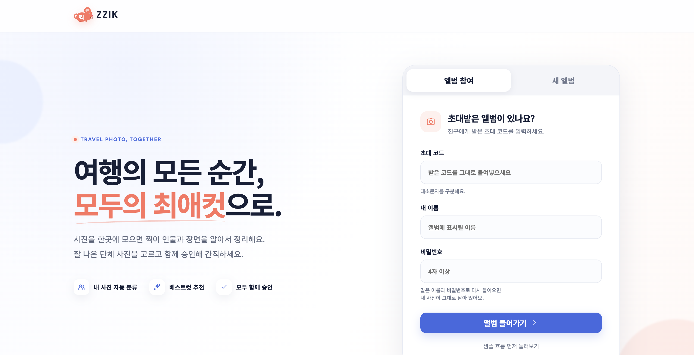
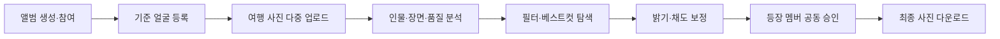
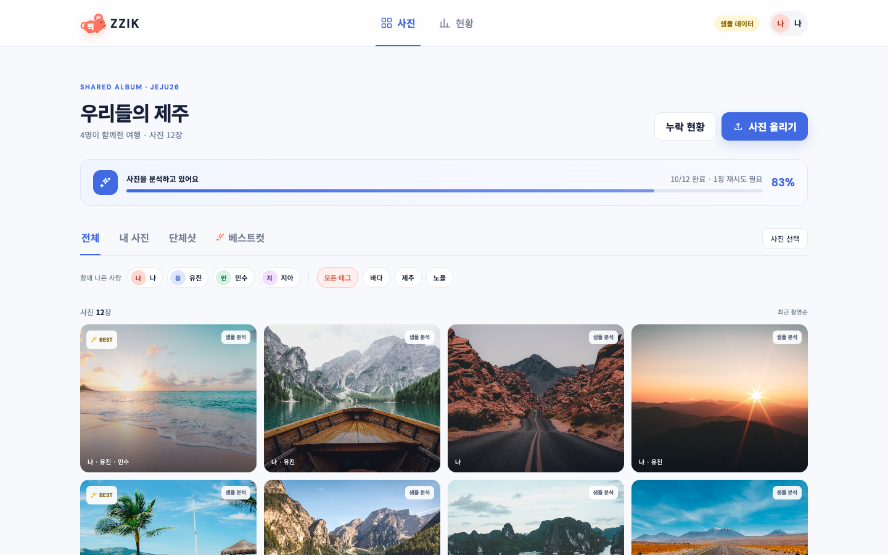
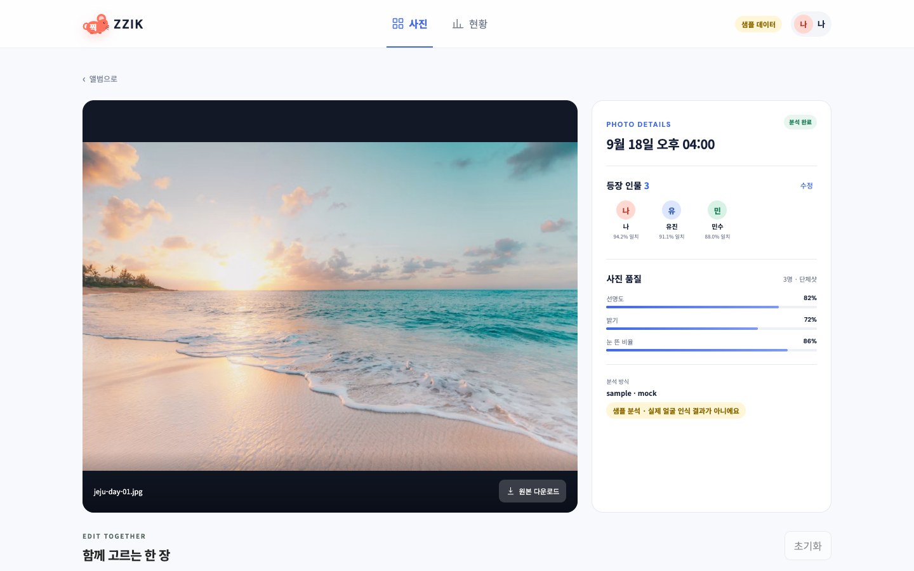
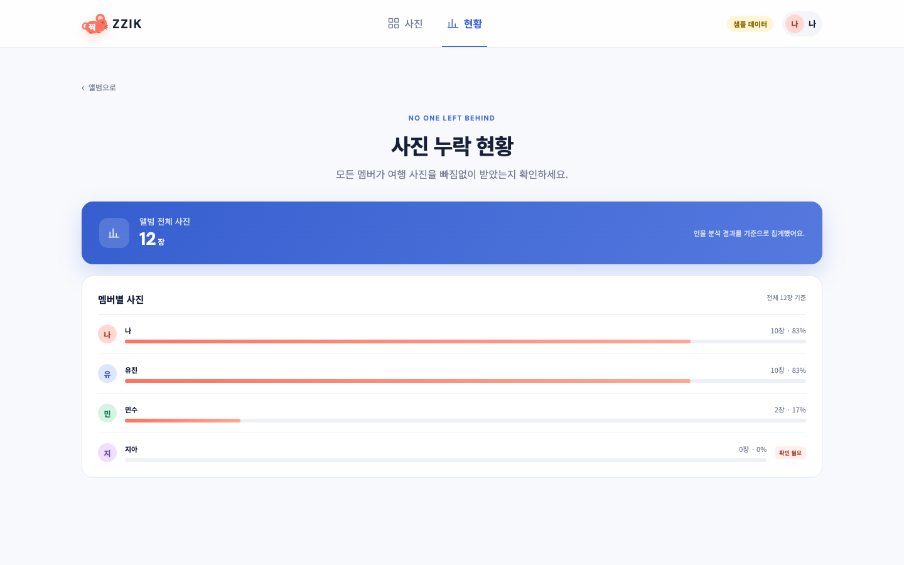
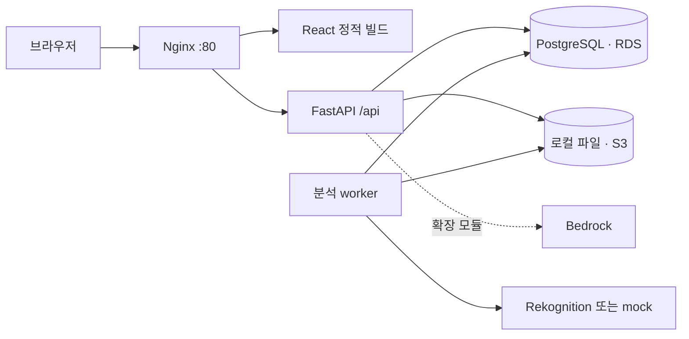

<div align="center">
  
  <h1>찍 · ZZIK</h1>
  <p><strong>여행 사진을 함께 모으고, 모두가 마음에 드는 최애컷을 고르는 공유 앨범</strong></p>
  <p>인물과 장면을 기준으로 사진을 정리하고, 보정본을 함께 승인해 한 번에 간직합니다.</p>
  <p>
    
    
    
    
    
  </p>
</div>

<p align="center">
  
</p>

2026년 국민대학교 캠퍼스타운 키로톤 01팀 **토큰사냥꾼** 프로젝트입니다.

> **배포 주소:** [http://44.221.76.15](http://44.221.76.15)  
> AWS EC2, RDS PostgreSQL, S3를 사용해 운영 중입니다. 현재 얼굴 분석은 Rekognition IAM 권한이 추가되기 전까지 mock provider로 실행됩니다.

[서비스 흐름](#서비스-흐름) · [화면 미리보기](#화면-미리보기) · [주요 기능](#주요-기능) · [기술 구성](#기술-구성) · [빠른 시작](#빠른-시작) · [전체 로컬 실행](#전체-로컬-실행) · [테스트](#테스트) · [팀](#팀)

## 서비스 소개

여행이 끝나면 사진은 여러 사람의 휴대폰에 흩어지고, 원하는 사진을 다시 고르는 데 많은 시간이 듭니다. 찍은 초대 코드 하나로 앨범에 모인 사진을 인물·단체 여부·장면 태그·품질에 따라 정리합니다.

멤버는 자신의 기준 얼굴을 등록하고 사진을 올립니다. 분석이 끝나면 내 사진과 단체 사진, 베스트컷을 빠르게 찾고 밝기와 채도를 조절할 수 있습니다. 사진에 나온 사람들이 보정본을 모두 승인하면 최종본으로 확정해 내려받습니다.

## 서비스 흐름



## 화면 미리보기

### 인물·장면별 앨범 갤러리

<p align="center">
  
</p>

얼굴 조합, 단체샷, 베스트컷, 장면 태그로 사진을 좁혀 보고 분석 진행률과 재시도 상태를 함께 확인합니다.

### 사진 분석과 보정 진입

<p align="center">
  
</p>

사진별 등장 인물과 일치도, 선명도·밝기·눈 뜬 비율을 확인하고 아래의 공동 보정 영역으로 이어집니다.

### 멤버별 사진 누락 현황

<p align="center">
  
</p>

앨범 전체 사진을 기준으로 각 멤버가 등장한 사진 수와 비율을 집계해, 여행 사진을 받지 못한 사람이 있는지 확인합니다.

> 화면 이미지는 `?data=mock` 데모에서 촬영했습니다. 데모 사진은 [Unsplash](https://unsplash.com/) 이미지를 사용하며, `샘플 분석` 값은 실제 얼굴 인식 결과가 아닙니다.

## 주요 기능

| 기능 | 구현 내용 |
|---|---|
| 공유 앨범 | 초대 코드와 이름으로 생성·참여, 서명된 세션 쿠키로 앨범 접근 제어 |
| 기준 얼굴 | 멤버별 정면 사진 등록, 얼굴 수 검증과 분석 제공자 정보 반환 |
| 사진 업로드 | JPEG·PNG 다중 업로드, 파일별 성공·실패 반환, 원본 바이트와 SHA-256 보존 |
| 사진 분석 | 기준 얼굴과 인물 매칭, 장면 태그·품질 지표, 분석 상태 조회·재시도 |
| 얼굴 상태 | 확정 인물, 미확정 얼굴, 미등록 얼굴, 사람이 없는 사진을 구분 |
| 갤러리 | 내 사진·단체샷·인물 조합·태그 필터, 촬영 시각·추천 점수 정렬, 연사 대표 컷 |
| 보정 버전 | 원본 기반 밝기·채도 조절, 원본 비교, 이전 버전에서 새 버전 생성 |
| 공동 승인 | 등장 확정 멤버의 명시적 승인·취소, 조건을 충족한 최종본 자동 집계 |
| 다운로드 | 원본·보정본 개별 다운로드, 선택 사진 ZIP API |
| 누락 현황 | 앨범 전체 사진 수와 멤버별 등장 사진 수 확인 |

분석 worker는 API와 별도 프로세스로 실행됩니다. 중단된 분석은 5분 lease 이후 회수하며 최대 3회 작업 시도 후 실패 처리합니다.

## 보정과 승인 규칙

- 밝기는 `0.5~1.5`, 채도는 `0.0~2.0` 범위입니다. 모든 설정은 항상 원본에 적용하며 보정본을 반복 덮어쓰지 않습니다.
- 새 버전은 승인 0개로 시작합니다. 좋아요나 저장 행위를 승인으로 간주하지 않습니다.
- 분석 완료 후 현재 앨범의 확정된 등장 멤버가 승인합니다. `no_face`이거나 확정 멤버가 없으면 업로더 1명의 승인이 필요합니다.
- 미확정·미등록 얼굴은 임의로 승인 대상에 넣지 않습니다.
- 승인 조건을 충족한 버전 중 번호가 가장 큰 버전이 최종본입니다. 승인 취소 시 이전 충족 버전으로 돌아갈 수 있습니다.
- 인물 변경이나 재분석이 일어나면 기존 승인을 무효화합니다.
- CSS 기반 빠른 미리보기는 근사값입니다. 저장 후에는 서버가 생성한 JPEG를 표시하고 같은 객체를 다운로드합니다.

## AI·이미지 분석

| 영역 | 현재 상태 |
|---|---|
| Amazon Rekognition | 얼굴 탐지·기준 얼굴 비교·장면 라벨·품질 지표 어댑터 구현 |
| 결정론적 mock | AWS 없이 동일한 API 계약으로 업로드·worker·화면 흐름 시연 가능 |
| 베스트컷 | 연사 그룹 안에서 선명도·밝기·눈 뜬 비율 등의 상대 점수로 대표 컷 선택 |
| Bedrock 여행 요약 | 집계 사실만 전달하는 3줄 요약 모듈과 자연어 필터 구조화 모듈 구현 |
| 미등록 얼굴 그룹 | 얼굴 crop 유사도 비교를 위한 그룹화 모듈 구현 |

Bedrock 요약·자연어 검색과 미등록 얼굴 그룹 모듈은 현재 API와 메인 화면에 연결되지 않은 확장 모듈입니다. 실제 Rekognition·Bedrock 호출도 AWS 계정에서 별도 검증해야 하며, 인증 실패를 mock 성공으로 자동 전환하지 않습니다. 분석 계약과 모드 구분은 [사진 분석 계약](docs/contracts/role-4-analysis.md)에 정리돼 있습니다.

## 기술 구성

| 영역 | 기술 |
|---|---|
| 프론트엔드 | React 19, TypeScript, Vite, Vitest, Testing Library |
| API | Python 3.13, FastAPI, 서명 세션 쿠키 |
| 데이터베이스 | SQLAlchemy 2, Alembic, PostgreSQL / 로컬 SQLite |
| 이미지 처리 | Pillow, 원본·썸네일·보정본 분리 저장 |
| 분석 | Amazon Rekognition 어댑터 / 명시적인 mock 제공자 |
| 생성형 AI 확장 | Amazon Bedrock, Anthropic SDK |
| 저장소 | 로컬 파일 / 비공개 Amazon S3 |
| 배포 | Nginx + FastAPI + worker를 단일 EC2에서 실행, 외부 RDS·S3 연결 |

의존성 버전은 [requirements.txt](requirements.txt)와 [frontend/package-lock.json](frontend/package-lock.json)을 기준으로 설치합니다.



## 실행 모드

프론트 샘플 모드와 백엔드 분석 제공자는 서로 다른 설정입니다.

| 실행 방식 | 의미 |
|---|---|
| 일반 프론트 URL | 실제 FastAPI의 같은 origin `/api`를 사용하는 기본 모드 |
| `?data=mock` | 백엔드 없이 UI를 둘러보는 브라우저 샘플 모드 |
| `FACE_PROVIDER=mock` | 실제 API·DB·파일 저장 흐름에서 합성 분석 결과 사용 |
| `FACE_PROVIDER=rekognition` | worker가 실제 AWS Rekognition 호출, 자동 mock 폴백 없음 |

## 빠른 시작

Node.js 24와 npm이 필요합니다. UI만 빠르게 확인하려면 다음 명령을 실행합니다.

```bash
git clone https://github.com/nxtcloud-edu/2026-kmuct-kt-team01.git
cd 2026-kmuct-kt-team01/frontend
npm ci
npm run dev
```

터미널에 표시된 Vite 주소 뒤에 `?data=mock`을 붙여 접속합니다.

```text
http://127.0.0.1:5173/?data=mock
```

샘플 모드는 브라우저 메모리의 데모 데이터를 사용합니다. 업로드·분석·보정 저장·다운로드 결과를 실제 영속 데이터나 얼굴 인식 정확도로 해석하지 않습니다.

## 전체 로컬 실행

### 1. 백엔드 환경 준비

저장소 루트에서 Python 3.13 가상환경을 만들고 의존성을 설치합니다.

```bash
python3.13 -m venv .venv
source .venv/bin/activate
python -m pip install -r requirements.txt
```

Windows PowerShell에서는 `./.venv/Scripts/Activate.ps1`로 활성화합니다.

### 2. 로컬 설정

macOS/Linux 예시입니다. API와 worker를 실행하는 두 터미널에 같은 값을 적용합니다.

```bash
export DATABASE_URL='sqlite+pysqlite:///./zzik_local.db'
export STORAGE_BACKEND='local'
export LOCAL_STORAGE_PATH='./storage'
export FACE_PROVIDER='mock'
export AWS_REGION='us-east-1'
export SESSION_SECRET='replace-with-your-own-local-secret'
```

PowerShell에서는 `export NAME=value` 대신 `$env:NAME = 'value'` 형식을 사용합니다. API는 `.env`도 읽지만 Alembic과 worker까지 같은 설정을 쓰려면 프로세스 환경변수로 전달하는 편이 안전합니다.

### 3. DB와 서버 실행

```bash
python -m alembic upgrade head
python -m uvicorn backend.app.main:app --host 127.0.0.1 --port 8000
```

별도 터미널에서 같은 가상환경과 환경변수로 worker를 실행합니다.

```bash
python -m backend.app.worker
```

- API 문서: `http://127.0.0.1:8000/docs`
- DB 준비 상태: `http://127.0.0.1:8000/api/health/ready`
- worker를 실행하지 않으면 업로드 사진의 분석이 대기 상태에 머무릅니다.
- readiness는 DB 연결 검사이며 S3·Rekognition·전체 사용자 흐름의 성공을 보장하지 않습니다.

### 4. 프론트 연결

```bash
cd frontend
npm ci
npm run dev
```

기본 URL이 실제 API 모드입니다. Vite는 `/api` 요청을 `http://127.0.0.1:8000`으로 프록시합니다. 백엔드 주소를 바꾸려면 `frontend/.env.local`에 다음 값을 넣고 Vite를 다시 시작합니다.

```dotenv
VITE_API_TARGET=http://127.0.0.1:8000
```

## 주요 설정

| 변수 | 용도 |
|---|---|
| `DATABASE_URL` | API·worker·Alembic이 함께 사용하는 SQLAlchemy DB 연결 문자열 |
| `SESSION_SECRET` | 세션 쿠키 서명 키 |
| `STORAGE_BACKEND` | `local` 또는 `s3` |
| `LOCAL_STORAGE_PATH` | 로컬 저장소 경로. API와 worker가 동일 위치 사용 |
| `S3_BUCKET` | S3 모드에서 사용할 비공개 버킷 |
| `AWS_REGION` | 현재 설계 리전 `us-east-1` |
| `FACE_PROVIDER` | `mock` 또는 `rekognition` |
| `MOCK_MANIFEST_PATH` | mock 샘플 정의 파일. 기본 `backend/samples/mock_manifest.json` |
| `VISION_PROVIDER` | `off` 또는 OpenAI 호환 멀티모달 분류를 사용하는 `gateway` |
| `VISION_API_BASE` | 게이트웨이의 `/v1` 기본 주소. HTTPS만 허용 |
| `VISION_API_KEY` | 게이트웨이 Bearer 키. 저장소에 커밋하지 않고 서버 환경파일에만 저장 |
| `VISION_MODEL_ID` | 이미지 입력을 지원하는 모델 별칭. 현재 배포 권장값 `bedrock-haiku` |

`VISION_PROVIDER=gateway`는 장면 태그와 일반 품질 점수만 외부 AI 결과로 바꿉니다. 얼굴 수와 인물 연결은 `FACE_PROVIDER` 결과를 유지하며, `FACE_PROVIDER=mock`과 함께 쓰면 화면에 하이브리드 분석으로 표시됩니다.

## 테스트

백엔드는 저장소 루트에서 실행합니다.

```bash
python -m pytest -q
python -m pytest docs/assembly/checks/role5_acceptance.py -q
```

두 번째 명령은 원본 보존, 두 세션 승인·취소, 최종 ZIP, 재시작, 분석 중 수동 수정에 대한 별도 수락 검사입니다. 검사에는 임시 `_test` DB와 테스트 저장소를 사용합니다.

프론트는 `frontend/`에서 실행합니다.

```bash
npm run typecheck
npm test
npm run build
```

현재 통합 기준 검증 결과는 백엔드 218개, 역할 5 수락 검사 4개, 프론트엔드 26개 테스트 통과입니다. 상세 이력은 [최종 통합 기록](docs/assembly/final-integration.md)과 [ROLE-05 작업 기록](docs/assembly/role-5.md)을 참고하세요.

## 배포

프로덕션 빌드는 같은 origin에서 정적 프론트와 `/api`를 제공합니다.

```bash
cd frontend
npm run build
```

빌드 결과는 `frontend/dist/`에 생성됩니다. Nginx·systemd·EC2·RDS·S3 설정, 사전 검사, 배포와 롤백 절차는 [인프라 안내](infra/README.md)와 [배포 스크립트](scripts/deploy.sh)를 참고하세요.

## 현재 제한사항

- 실제 AWS Rekognition·Bedrock 호출, 전용 PostgreSQL 동시성, EC2 배포 전체 흐름은 아직 실제 계정에서 검증하지 않았습니다.
- Bedrock 여행 요약·자연어 검색과 미등록 얼굴 그룹 코드는 API와 메인 UI에 아직 연결되지 않았습니다.
- mock의 similarity와 품질 값은 실제 인식 정확도가 아닙니다.
- 파일당 업로드 한도는 25 MiB, 보정 픽셀 한도는 2천만 픽셀입니다. Nginx의 요청 전체 한도는 `30M`입니다.
- 원본·보정본 다운로드의 `Content-Disposition`에 비 ASCII 파일명을 직접 넣는 코드가 남아 있어 한글 파일명 오류 수정이 필요합니다. [관련 이슈 #7](https://github.com/nxtcloud-edu/2026-kmuct-kt-team01/issues/7)
- 최종 ZIP은 API에서 `version="final"`로 요청할 수 있습니다. 갤러리의 선택 ZIP UI는 기본 원본 다운로드를 사용합니다.

## 저장소 구조

```text
backend/app/             API·모델·스토리지·분석·보정·worker
backend/tests/           ROLE-05 렌더·버전·승인 테스트
frontend/src/            앨범 화면·API 클라이언트·편집 패널
frontend/public/         로고와 정적 자산
alembic/                 DB 마이그레이션
tests/                   공통 API·스토리지·분석·worker 테스트
docs/assets/readme/      README 화면 이미지
docs/                    팀 계약·역할별 인계·통합 기록
infra/                   배포 환경 안내
scripts/                 배포·사전 검사·백업·복구·롤백
systemd/                 API·worker 서비스 설정
```

## 팀

| 담당 | 역할 |
|---|---|
| [junseok0929](https://github.com/junseok0929) | 역할 1 · 인프라·배포 |
| [seopseopi](https://github.com/seopseopi) | 역할 2 · 프론트엔드 |
| [y3rtcn](https://github.com/y3rtcn) | 역할 3 · 백엔드·최종 통합 |
| [jooya38](https://github.com/jooya38) | 역할 4 · 사진 분석·품질 |
| [tkdgur3207](https://github.com/tkdgur3207) | 역할 5 · 이미지 보정·버전·승인 |

제출 기준 브랜치는 `main`, 실행 ID는 `20260920`입니다. 협업 규칙은 [팀 설정](docs/TEAM_SETUP.md)과 [Git 작업 규칙](docs/GIT_WORKFLOW.md)에 정리돼 있습니다.
